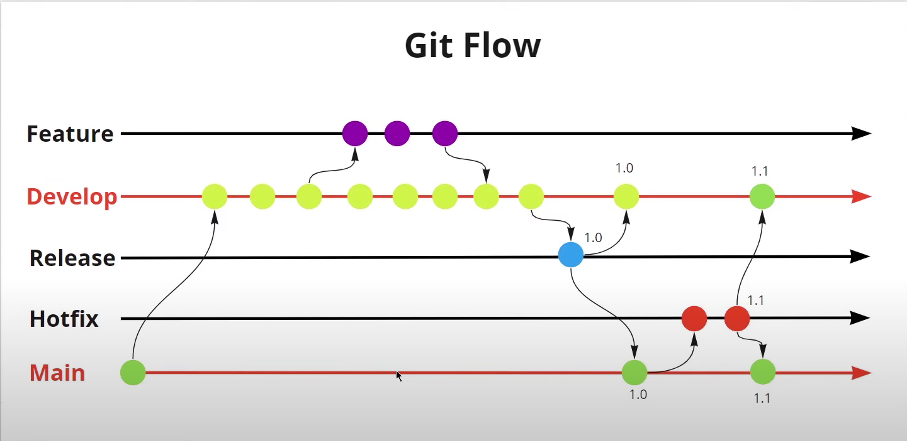

# Gitflow

> Tutorial de como usar GitFlow

## Fluxo do Gitflow


## Comando para usar o Gitflow

**Iniciando o gitflow:**
```git
git flow init
```
**Criando uma feature:**
```git
git flow feature start NOME
```
**Pull da feature para o github:**
```git
git flow feature publish NOME
```

**Merge da feature para a branch develop: (branch apagada)**
```git
git flow feature finish NOME
```
**Criando a branch release para testar os códigos:**
```git
git flow release start VERSAO 
```

**Excluindo a branch release e mergiando com a main e a develop:**
```git
git flow release finish VERSAO 
```

**Criando branch hotfix/bugfix na main para corrigir erros/bugs:**
```git
git flow hotfix start VERSAO_MAIN_ADD
```

**Excluindo a branch hotfix/bugfix e mergiando na main e na develop:**
```git
git flow hotfix finish VERSAO_MAIN_ADD
```

**Fazendo push das branchs main e develop para o github**
```git
git push --all
```
*obs: tanto faz executar o comando acima na main ou na develop.*


